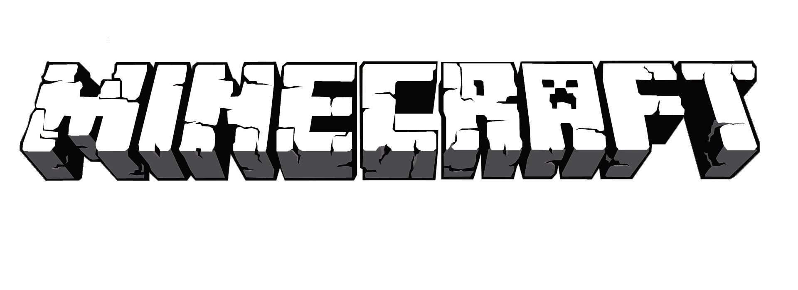

# MINECRAFT Clone

### C++20 · DirectX 11 · Custom Engine · 1인 프로젝트

**자체 제작 DirectX 11 엔진으로 절차적 복셀 월드와 생존 플레이를 구현한 《Minecraft》 모작**

## 프로젝트 정보

| 항목 | 내용 |
| --- | --- |
| 장르 | 3D 복셀 샌드박스 · 생존 |
| 개발 기간 | 2026.04.26 ~ 2026.06.26 |
| 개발 인원 | 1명 |
| 개발자 | [limits1214](https://github.com/limits1214) · 임성윤 |
| 플랫폼 | Windows x64 |
| 개발 환경 | Visual Studio · Windows SDK 10.0 |
| 제작 범위 | Framework · Voxel World · Rendering · Gameplay · UI/Tool |
| 기술 스택 | • C++20 • DirectX 11 · HLSL · DirectInput 8 • DirectXTex · DirectXTK · FMOD 2.03.12 • Dear ImGui 1.83 · ImGuizmo 1.83 • FastNoiseLite · nlohmann/json 3.12.0 |

## 주요 콘텐츠

- 높이·온도·습도·동굴·광물 노이즈로 생성되는 평원·사막·설원 복셀 월드
- 채굴 단계와 도구별 속도, 블록 설치·드롭, 물·용암 전파와 실시간 광원 갱신
- 9칸 핫바·인벤토리·방어구, 2×2/3×3 제작, 화로 제련과 상자 보관
- FPS/TPS 카메라, 근접·활 전투, 동물과 좀비·스켈레톤·크리퍼 AI
- 낮과 밤·태양과 달·이동 구름, TNT 연쇄 폭발과 지형 파괴
- 경험치 레벨에 따라 연사·폭발 화살·비행을 해금하는 Bless/Totem 시스템

## 구현 내용

### 핵심 시스템

- Prototype·Component·Level 구조와 관리자 파사드로 구성한 자체 게임 프레임워크
- Generation Handle/Slot과 부모-자식 GameObject·Layer를 활용한 객체 수명 관리
- 스레드 풀과 Future 기반의 비동기 청크 생성 → 조명 계산 → 메시 생성 파이프라인
- Render Group/Pass, Shadow Mapping, 리소스·입력·충돌·카메라·사운드 통합 관리

### 콘텐츠 구현

- 32×256×32 청크 스트리밍과 Frustum Culling, 노출 면 컬링, Vertex AO
- Solid·Alpha Test·Water 분리 메시와 횃불·식생·슬랩·계단 전용 지오메트리
- 하늘광·블록광 Flood Fill, 물·용암 Tick, DDA Raycast와 복셀 AABB 충돌
- 생존 상태·인벤토리·제작·제련·보관, 엔티티 AI·전투·드롭·경험치 연동

### Tool

- Dear ImGui 기반 오브젝트·컴포넌트·리소스·렌더러·카메라 런타임 검사 도구
- 충돌체 시각화, 복셀 피킹·청크 로드 제어, 워커 큐·스레드 상태 모니터링
- 셰이더 런타임 재빌드와 파티클·사운드·엔티티 소환 테스트 기능
