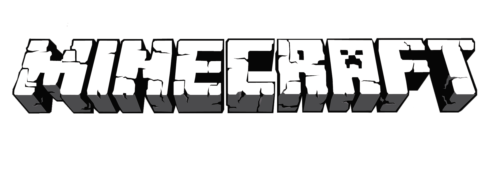

<div align="center">

# MINECRAFT Clone



### C++20 · DirectX 11 · Custom Engine · 1인 프로젝트

**자체 제작 DirectX 11 엔진으로 절차적 복셀 월드와 생존 플레이를 구현한 《Minecraft》 모작**

</div>

## 시연영상

[시연영상 보기](https://youtu.be/XydlgGmM784)

## 프로젝트 정보

| 항목 | 내용 |
| --- | --- |
| 장르 | 3D 복셀 샌드박스 · 생존 |
| 개발 기간 | 2026.04.26 ~ 2026.06.26 |
| 개발 인원 | 1명 |
| 개발자 | [limits1214](https://github.com/limits1214) · 임성윤 |
| 플랫폼 | Windows x64 |
| 개발 환경 | Visual Studio · Windows SDK 10.0 |
| 제작 범위 | Framework · Voxel World · Rendering · Gameplay · UI/Tool |
| 기술 스택 | • C++20<br>• DirectX 11 · HLSL · DirectInput 8<br>• DirectXTex · DirectXTK · FMOD 2.03.12<br>• Dear ImGui 1.83 · ImGuizmo 1.83<br>• FastNoiseLite · nlohmann/json 3.12.0 |

## 주요 콘텐츠

- 높이·온도·습도·동굴·광물 노이즈로 생성되는 평원·사막·설원 복셀 월드
- 채굴 단계와 도구별 속도, 블록 설치·드롭, 물·용암 전파와 실시간 광원 갱신
- 9칸 핫바·인벤토리·방어구, 2×2/3×3 제작, 화로 제련과 상자 보관
- FPS/TPS 카메라, 근접·활 전투, 동물과 좀비·스켈레톤·크리퍼 AI
- 낮과 밤·태양과 달·이동 구름, TNT 연쇄 폭발과 지형 파괴
- 경험치 레벨에 따라 연사·폭발 화살·비행을 해금하는 Bless/Totem 시스템

## 구현 내용

### 핵심 시스템

- Prototype·Component·Level 구조와 관리자 파사드로 구성한 자체 게임 프레임워크
- Generation Handle/Slot과 부모-자식 GameObject·Layer를 활용한 객체 수명 관리
- 스레드 풀과 Future 기반의 비동기 청크 생성 → 조명 계산 → 메시 생성 파이프라인
- Render Group/Pass, Shadow Mapping, 리소스·입력·충돌·카메라·사운드 통합 관리

### 콘텐츠 구현

- 32×256×32 청크 스트리밍과 Frustum Culling, 노출 면 컬링, Vertex AO
- Solid·Alpha Test·Water 분리 메시와 횃불·식생·슬랩·계단 전용 지오메트리
- 하늘광·블록광 Flood Fill, 물·용암 Tick, DDA Raycast와 복셀 AABB 충돌
- 생존 상태·인벤토리·제작·제련·보관, 엔티티 AI·전투·드롭·경험치 연동

### Tool

- Dear ImGui 기반 오브젝트·컴포넌트·리소스·렌더러·카메라 런타임 검사 도구
- 충돌체 시각화, 복셀 피킹·청크 로드 제어, 워커 큐·스레드 상태 모니터링
- 셰이더 런타임 재빌드와 파티클·사운드·엔티티 소환 테스트 기능

## 리소스 및 실행 준비

게임 리소스는 `MC_DX11_RESOURCE` 폴더에 일반 Git 파일로 포함되어 있습니다. 별도의 리소스 저장소 다운로드, 서브모듈 초기화 또는 Git LFS 다운로드는 필요하지 않습니다.

```text
MC_DX11_RESOURCE/
├─ Font/
├─ Shader/
├─ Sound/
└─ Texture/
```

### 최초 1회 준비

- Visual Studio 2022 17.14 이상 또는 Visual Studio 2026: **C++를 사용한 데스크톱 개발**, **MSVC v143 x64/x86 빌드 도구**, **Windows SDK 10.0.26100.0 이상**을 설치합니다.
- vcpkg를 설치한 뒤 해당 폴더의 PowerShell에서 `.\vcpkg.exe integrate install`을 한 번 실행하고 Visual Studio를 다시 엽니다. DirectXTex와 DirectXTK는 `vcpkg.json`에 따라 첫 빌드 때 자동 설치되므로 인터넷 연결이 필요합니다.
- FMOD는 `ThirdParty`에 포함되어 있어 별도로 다운로드하지 않아도 됩니다.

### 빌드 및 실행

1. 저장소를 Clone하거나 Download ZIP으로 받아 압축을 풉니다.
2. `MC_DX11.slnx`를 Visual Studio에서 엽니다.
3. **Release | x64**를 선택하고 솔루션을 빌드합니다. **Debug | x64**도 사용할 수 있습니다.
4. `Client`를 시작 프로젝트로 설정한 뒤 **F5**를 누릅니다. 빌드 후 `Client/Bin/Client.exe`를 직접 실행해도 됩니다.

빌드 과정에서 `CopyClient.bat`이 다음 파일을 자동 배치합니다. 관리자 권한이나 수동 심볼릭 링크 생성은 필요하지 않습니다.

- 엔진 헤더·라이브러리 → `EngineSDK/Inc`, `EngineSDK/Lib`
- `Engine.dll`, `fmod.dll`, 빌드 구성에 맞는 vcpkg DLL → `Client/Bin`
- `MC_DX11_RESOURCE`의 네 폴더 → `Client/Bin/Resources`

디버깅 작업 폴더도 프로젝트에 `Client/Bin`으로 설정되어 있습니다. 기존에 `Resources`를 원본 리소스 폴더로 연결해 둔 경우에는 링크를 그대로 사용합니다. 다른 위치를 가리키는 링크는 자동으로 덮어쓰지 않고 오류를 표시합니다.

리소스를 수정한 뒤에는 솔루션을 다시 빌드해 실행 폴더에 반영해 주세요. Visual Studio가 최신 상태로 판단해 빌드를 생략하면 **솔루션 다시 빌드**를 사용합니다. 셰이더를 프로젝트에서도 참조하므로 원본 `MC_DX11_RESOURCE` 폴더의 이름과 위치는 유지해 주세요.
